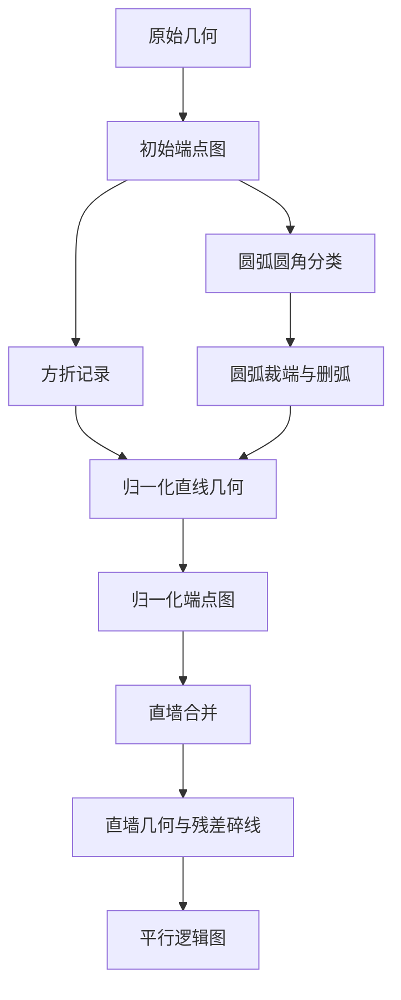
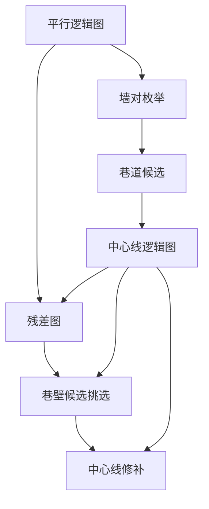
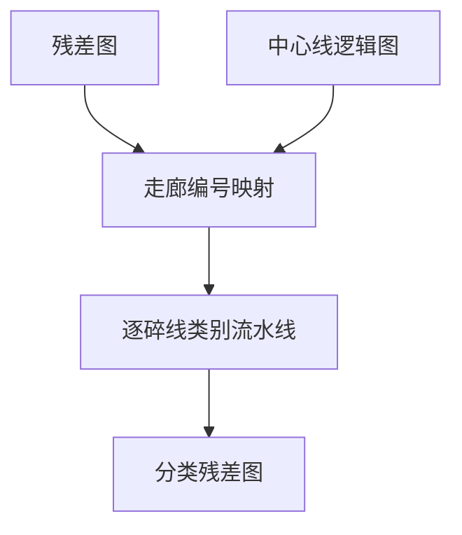

# 矿井巷道几何处理方法

本文档说明流水线各部分的**工作机制**：输入是什么、经过哪些判定与变换、输出什么逻辑结构。总体架构与产物清单见 `docs/01-architecture-zh.txt`。

行文遵循 `重要原则.txt`：书面语、正式语气；以步骤与机制为叙述单位，不罗列仓库内的程序文件；若必须引用代码中的标识符（边类型、类别标签等），均附简要含义。

---

## 总则

### 数据形态

整条流水线在两类表示之间交替推进：

1. **几何表示**：线段端点坐标、图元句柄、合并后的墙段列表等，供可视检查与坐标运算。
2. **逻辑拓扑图**：节点表示墙段、碎线或巷道候选；边表示端点邻接、平行配对或碎线附着关系。每个完整处理步骤**只接受一张**逻辑拓扑图作为主要输入，**只产出一张**作为主要输出。

中间审计列表（弯折记录、分类结果、修补日志等）辅助排查，**不能**替代拓扑图成为下游步骤的正式输入。

### 三部分划分

| 部分 | 对应阶段 | 核心问题 |
|------|----------|----------|
| **第 1 部分** | stage2 | 图纸线段如何变为可归并的直墙与平行墙对 |
| **第 2 部分** | stage3 | 平行墙对如何变为巷道候选与可连通的中心线，以及如何修补断裂 |
| **第 3 部分** | stage4 | 未并入直墙的碎线区域属于何种工程对象类别 |

各部分内部的多项功能均须**分步单独运行**，禁止用单一总流程脚本串联全部子功能。

### 尺度约定

多数距离、间隙、腿长阈值不写死绝对米数，而相对于**图面中位巷道宽度**或**平行边上的配对宽度**缩放。中位宽度通常由端点图上平行邻接边的墙间距统计得到，并随候选列表或中心线图向下游传递。

---

## 第 1 部分：墙段几何基础（stage2）

第 1 部分回答：从导出的直线与圆弧图元出发，如何得到**仅含直线的归一化几何**、**端点邻接图**，以及**直墙与碎线的平行逻辑图**。本部分不做巷道候选、不做主巷/横档/腔室类别判定。

整体顺序如下：



### 1.1 构建初始端点图

**作用**：将原始几何中的每条直线、每段圆弧转为图节点；在端点彼此接近且满足角度条件的图元之间建立**端点邻接边**。

**机制要点**：

- 邻接边记录端点间隙、夹角、是否近似平行或正交等属性，供后续共线合并与弯折分析使用。
- 此时尚未区分方折、圆角或直墙，也尚未删除圆弧。

**输出**：初始端点图（含直线与圆弧节点）。

### 1.2 方折检测

**作用**：在初始端点图上识别两直线相交成近似直角的折点，写入方折记录。

**机制要点**：

- **只记录，不改坐标**。方折信息供审计与后续类别判定参考，不参与本部分的圆弧裁端。
- 方折检测与圆弧圆角检测相互独立，分步运行。

### 1.3 圆弧圆角分类

**作用**：对每条圆弧评估其作为「墙角圆角」的可信度，区分为可信圆角与未知圆弧两类。

**机制要点**：

- 综合局部尺度、切点位置、邻域夹角、裁端可行性等信号加权打分。
- **只写分类结果，不修改几何**。几何变更留给下一步。

### 1.4 圆弧归一化

**作用**：仅针对上一步标记为可信圆角的弧段，裁切相邻直线端点并删除圆弧，以折线近似原圆角。

**机制要点**：

- 读取分类结果，对未标记为圆角的圆弧保持不动。
- 与分类步骤严格分离，避免「边判边改」难以复查。

### 1.5 合并归一化几何并构建归一化端点图

**作用**：将裁端后的直线段与未修改图元合并为统一的直线几何；在**仅含直线**的集合上重建端点邻接图。

**机制要点**：

- 归一化端点图是第 1 部分下游步骤的正式拓扑输入。
- 连续墙段合并不在此进行，留给直墙识别步骤。

**输出**：归一化直线几何、归一化端点图。

### 1.6 直墙识别与残差碎线分离

**作用**：在归一化端点图上搜索**共线链**，将可合并的短线段并成长直墙；其余短线段与未合并图元归入残差碎线。

**判定要点**：

| 条件 | 含义 |
|------|------|
| 端点接近 | 链上相邻段端点间隙小于连续性阈值 |
| 近共线 | 相邻段方向夹角小于角度阈值 |
| 横向偏移 | 链上段中心线横向偏离小于横向容差 |
| 正交分支 | 间隙端点处若存在近似正交的另一分支，则不在开口处强行共线合并（避免横档开口被误并） |

**分类结果**：

| 类别 | 含义 | 后续角色 |
|------|------|----------|
| **直墙** | 共线链，或长度超过短段阈值的单段 | 平行配对与巷道候选的输入 |
| **残差碎线** | 未并入直墙的短段 | 保留原句柄；进入平行逻辑图的碎线节点；工程对象类别在第 3 部分标注 |

短段阈值随图面估计巷道宽度缩放。

**输出**：直墙几何列表、残差几何列表（均为坐标表示，尚非平行逻辑图）。

### 1.7 构建平行逻辑图

**作用**：以直墙与碎线为节点，建立两类逻辑边：**端点邻接**与**平行配对**。

**节点**：

- 直墙节点：带起止点、方向、长度及合并成员句柄。
- 碎线节点：带起止点、原图元句柄；参与端点邻接，但**不参与**第 2 部分的巷道候选生成。

**平行配对判定**（在直墙—直墙之间）：

- 方向近似平行；
- 墙间距落在由图面中位宽度导出的带宽内；
- 投影重叠比达到下限。

满足条件的墙对之间写入平行边，边上携带墙间距与重叠比。

**平行墙组**：平行边的连通分量仅作索引，**不是**巷道候选。

**输出**：平行逻辑图（第 1 部分的最终拓扑产物）。

---

## 第 2 部分：巷道候选与中心线（stage3）

第 2 部分回答：平行墙对如何变为带中心线坐标的巷道候选，候选之间如何连成中心线逻辑图，以及当中心线因碎线而断裂时如何通过残差拓扑加以修补。本部分**不**判定主巷、横档或腔室角色。



### 2.1 由平行边生成墙对与巷道候选

**作用**：从平行逻辑图中枚举墙—墙平行边，每条边对应一个墙对；由墙对几何计算一个巷道候选。

**机制要点**：

- **不从平行墙组出发**，逐边生成，避免把索引结构误当作候选。
- 在较长墙朝向上求两墙的投影重叠区间；重叠区间的中线即候选中心线。
- 左右墙编号按固定的叉积规则确定，保证同一墙对结果可复现。
- 可对墙对去重，但不在竞争墙对之间合并候选。

**本步不做**：主巷筛选、横档/腔室判别、按墙间距二次过滤（配对已在第 1 部分完成）。

**输出**：巷道候选列表（含中心线坐标、墙间距、重叠比及全图尺度统计）。

### 2.2 构建中心线逻辑图

**作用**：以每个巷道候选的中心线为节点，建立与第 1 部分平行逻辑图**同构的边模型**：端点邻接边与平行边。

**机制要点**：

- 端点邻接：两条候选中心线端点足够接近且方向连续时连边，用于表达轴向可延续关系。
- 平行边：两条候选中心线近似平行且横向间距合理时连边。
- 全图尺度（中位巷道宽度等）写入图的全局属性，供下游阈值解析。

**输出**：中心线逻辑图（第 2 部分前半段的最终拓扑产物）。

### 2.3 问题背景：中心线为何会断

第 1 部分在圆角、方折、横档开口等处常将短线段保留为**碎线**而非直墙。第 2 部分前半段仅从**直墙平行对**生成候选，桥接几何若只存在于碎线中，则不会出现新的候选，中心线逻辑图上也就没有延续边——断裂本质是**缺墙段**，而非已有候选之间少连一条边。

### 2.4 构建残差图

**作用**：在平行逻辑图的墙与碎线事实层之上，专门为碎线建立一张**残差拓扑图**，描述碎线之间、碎线与走廊边界墙之间的四类关系。

| 边类型 | 含义 |
|--------|------|
| 碎线—碎线接触 | 端点在缩放间隙内首尾相接 |
| 走廊—碎线接触 | 碎线触及某条走廊的边界墙（运行时可写入走廊编号） |
| 碎线—碎线平行 | 间距落在巷道宽度带内的平行碎线对 |
| 走廊—碎线平行 | 碎线与已确定的走廊边界墙平行 |

**残差组（RC）**：

- **RC_v1**：仅沿碎线接触边求连通分量，对应传统的端点链分组。
- **RC_v2**：在碎线接触边与碎线平行边的并集上求连通分量；第 3 部分以此作为附着区域的主划分。

附着容差、端点链接间隙等阈值随中位巷道宽度缩放。

**输出**：残差图。

### 2.5 挑选可能巷壁碎线

**作用**：在残差图上，结合只读的中心线逻辑图，将走廊编号映射到走廊—碎线接触边，并标记行为上像「缺失巷壁」的碎线。

**挑选规则（概要）**：

- 碎线同时接触两条及以上走廊；或
- 碎线接触一条走廊，且存在指向边界墙的走廊—碎线平行关系。

被选中碎线打上可能巷壁标签，写出带标签的残差图。

**输出**：带可能巷壁标签的残差图。

### 2.6 提升巷壁并修补中心线

**作用**：将符合条件的可能巷壁提升为确定墙节点，并延伸或补写受影响走廊的中心线几何。

**提升**：当通过对侧平行关系或缩放限制内的几何共线确认对侧直墙存在时，碎线方可提升。

**延伸修补**：沿提升碎线与正确对侧墙的重叠区间延长中心线；**仅当合并后轴向长度增加**时才写入，防止误缩短。

**合成连接器**（与横档类别无关）：若某一平行残差分量在轴向两端均已关联既有走廊拓扑，可沿平行方向补写一段中心线以闭合几何连续性。该操作只修复断裂，**不是**横档识别，也**不是**腔室判别。

**输出**：修补后的中心线逻辑图。

---

## 第 3 部分：残差区域类别标注（stage4）

第 3 部分回答：残差碎线中，哪些属于凹进、哪些与已知巷壁共线、哪些构成横档形辅巷道。本部分**只做识别与标注**，不合并主巷网络，不改写第 1、第 2 部分已稳定的几何与候选产物。



### 3.1 输入与准备

**主要拓扑输入**：第 2 部分产出的残差图。

**辅助只读输入**：中心线逻辑图，用于：

- 将走廊编号写入走廊—碎线接触边；
- 提供中位巷道宽度等尺度。

映射完成后，分类逻辑以带走廊编号的残差图为工作对象。

### 3.2 逐碎线类别流水线

分类**按碎线逐条**进行，与残差组分组无关；四条规则按固定顺序执行，先命中先标注：

| 顺序 | 类别标签 | 含义 | 典型形状直觉 |
|------|----------|------|--------------|
| 1 | 凹进（NICHE） | 三条碎线首尾相接，外侧两腿平行 | 「几」形侧向凹进 |
| 2 | 可能巷壁（POSSIBLE_CORRIDOR_WALL） | 与已知走廊边界墙平行的碎线 | 应与既有墙共线的短段 |
| 3 | 辅巷道（AUXILIARY_CORRIDOR） | 平行碎线对，两腿长度均超过「尺度系数 × 该平行边上的配对宽度」 | 「=」形横档 |
| 4 | 未分类（UNCLASSIFIED） | 以上均未命中 | — |

**腿长判定**：优先使用碎线—碎线平行边上记录的配对宽度；缺失时回退至中心线图的全局中位巷道宽度。尺度系数为可配置参数（当前默认约 2.7 倍）。

每条碎线附带置信度、分类来源及所属残差组编号，供后续主巷网络构建过滤使用。

### 3.3 与第 2 部分修补机制的边界

下列概念**不得混用**：

| 机制 | 所在部分 | 目的 |
|------|----------|------|
| 可能巷壁标签（修补挑选） | 第 2 部分后半 | 找出应提升为墙以延伸中心线的碎线 |
| 可能巷壁类别（形状重标） | 第 3 部分 | 标注与边界墙平行的碎线形状 |
| 合成连接器 | 第 2 部分后半 | 补写中心线几何连续性 |
| 辅巷道类别 | 第 3 部分 | 标注横档形平行碎线对 |

### 3.4 输出

**拓扑输出**：分类残差图——残差图之上为每个碎线节点写入类别标签与审计字段（产物文件名仍为 `*_residual_graph_semantic.pkl`，保持稳定）。

**摘要输出**：逐碎线分类列表及各类计数，供检查图着色与人工复核。

---

## 三部分之间的依赖关系

```text
第 1 部分
  归一化端点图 ──────────────────────────────┐
  平行逻辑图 ────┬──────────────────────────┼──→ 第 2 部分（残差图构建）
  直墙几何 ──────┼──→ 第 2 部分（候选生成）  │
  残差碎线几何 ──┘                          │
                                            │
第 2 部分                                    │
  巷道候选列表 ──→ 中心线逻辑图 ─────────────┼──→ 第 3 部分（走廊映射与尺度）
  残差图 ───────────────────────────────────┘
  修补后中心线逻辑图 ──→ 更后阶段（主巷网络，未在本文展开）

第 3 部分
  分类残差图 ──→ 更后阶段（主巷连通时排除腔室、保留横档等，未在本文展开）
```

第 2 部分各子步之间、第 1 部分各子步之间，均为**数据流依赖**：后一步读取前一步的拓扑图或几何列表，一般不跨部分调用对方的处理逻辑。

---

## 修订记录

| 日期 | 变更 |
|------|------|
| 2026-07-13 | 首版：按 stage2 / stage3 / stage4 三部分记述工作机制；不涉及仓库内程序文件名 |
