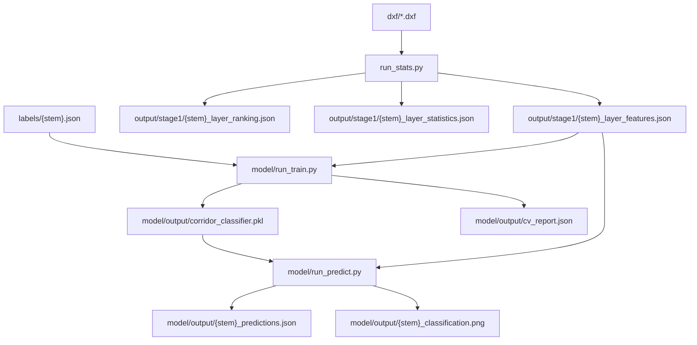

# Stage 1 — Corridor layer workflow

## Goal (from README)

1. Input a DXF and extract **per-layer statistical features** (geometry + annotation).
2. Predict which **layers contain corridors (巷道)**, **without using layer names at inference**.
3. Manual labels are allowed at **train time only**; some layers carry corridor geometry incidentally (drop-in labels), not because the layer is primarily a corridor layer.

---

## Directory layout

```
4.4/
├── dxf/                          # Source drawings
├── labels/
│   ├── examples.txt              # Label templates / notes
│   ├── 2-main.json               # Manual labels (train only)
│   └── 2026.1-2.json
├── stage1/
│   ├── run_stats.py              # Step 1: features + rule ranking
│   ├── run_classify.py           # Legacy: per-drawing classifier (weak labels)
│   ├── layer_features.py         # Feature extraction
│   ├── feature_vector.py         # 24-D vectors for ML
│   ├── layer_scorer.py           # Rule-based ranking (no layer names)
│   ├── layer_classifier.py       # Legacy single-file trainer
│   ├── visualize_layers.py       # Red/grey DXF overlay
│   ├── output/stage1/            # Per-drawing feature exports
│   └── model/                    # ML training & evaluation
│       ├── run_train.py
│       ├── run_evaluate.py
│       ├── run_predict.py
│       └── output/               # Shared model + predictions
```

---

## End-to-end workflow



### Step 1 — Extract features (every new DXF)

From `stage1/`:

```powershell
python run_stats.py --dxf ../dxf/2026.1-3.dxf
```

Or from project root `4.4/`:

```powershell
python -m stage1.run_stats --dxf dxf/2026.1-3.dxf --output-dir stage1/output/stage1
```

**Outputs** under `stage1/output/stage1/`:

| File | Purpose |
|------|---------|
| `{stem}_layer_statistics.json` | Entity-type counts per layer (quick inventory) |
| `{stem}_layer_features.json` | **ML input** — geometry + annotation per layer |
| `{stem}_layer_ranking.json` | Rule-based corridor candidates (baseline, no names) |
| `{stem}_corridor_layers.json` | Optional: raw geometry of top-k layers (`--export-top`) |

Each layer → **24-D feature vector** (`feature_vector.py`):

- Geometry: `n_segments`, lengths, `parallel_pair_ratio`, `long_segment_ratio`, 8-bin direction histogram
- Annotation: text/dimension/leader stats, `line_ratio`, `lwpolyline_ratio`

### Step 2 — Manual labels (train time only)

One JSON per drawing stem under `labels/`:

```json
{
  "corridor_layers": ["巷道", "进尺"],
  "non_corridor_layers": ["图例", "矿界", "等高线"]
}
```

Auto-matching rule: `labels/{stem}.json` ↔ `output/stage1/{stem}_layer_features.json`.

**Current labeled drawings:** `2-main`, `2026.1-2` (80 layers total).

Layers can be positive even when corridors are not the layer's primary purpose (e.g. `90`, `进尺`, `积水线探水线` on `2-main`).

### Step 3 — Train ML model (multi-drawing)

From `stage1/`:

```powershell
python model/run_train.py --model random_forest
```

Trains on **all** labeled `*_layer_features.json` files, runs **leave-one-drawing-out (LOO-CV)**, saves:

- `model/output/corridor_classifier.pkl`
- `model/output/cv_report.json`

**Models:** `logistic` (default) or `random_forest` (better on current data).

**LOO-CV:** hold out one entire drawing, train on the rest, test on held-out layers. With 2 drawings this gives 2 folds. Measures cross-drawing generalization (not random layer splits).

### Step 4 — Evaluate

```powershell
python model/run_evaluate.py --model random_forest
```

Writes `model/output/evaluation_report.json` with per-fold, per-layer correct/MISS breakdown.

### Step 5 — Predict on any drawing

```powershell
PS D:\大创\25.9\代码\5.29\stage1> python model/run_predict.py `
   --features stage1/output/stage1/XJH2025.9.30_layer_features.json ` 
  --dxf D:\大创\25.9\代码\XJH\XJH2025.9.30.dxf
```

**Outputs:**

- `model/output/{stem}_predictions.json` — all layers with `label` (0/1) and `probability`
- `model/output/{stem}_classification.png` — red = predicted corridor, grey = other

**Red layers in PNG** = entries with `"label": 1` in the predictions JSON.

Paths resolve against project root `4.4/` even when run from `stage1/`.

---

## Two classifier paths

| | **ML (`stage1/model/`)** | **Legacy (`run_classify.py`)** |
|--|--------------------------|--------------------------------|
| Labels | Manual `labels/*.json` only | Manual or weak name bootstrap |
| Training scope | All labeled drawings | Single drawing |
| Model file | `model/output/corridor_classifier.pkl` | `output/stage1/{stem}_layer_classifier.pkl` |
| Evaluation | LOO-CV in `run_train` / `run_evaluate` | None built-in |
| Use when | Production path | Quick one-off with weak labels |

Prefer **`stage1/model/`** for anything beyond prototyping.

---

## Inference vs training

| Phase | Uses layer name? |
|-------|------------------|
| Feature extraction | No |
| Manual labels | Yes (train only) |
| Weak labels (`layer_classifier.py`) | Yes (train only, legacy) |
| ML / rule prediction | No — geometry features only |

---

## Current status (as of last train)

**Dataset:** 80 labeled layers, 13 positive / 67 negative, from `2-main` + `2026.1-2`.

**LOO-CV (random_forest):** accuracy 0.85, precision 1.0, recall 0.08, F1 0.14.

- Held-out `2-main`: recall 0% — model trained on `*年巷道` layers does not yet generalize to `2-main`'s incidental corridor layers.
- Held-out `2026.1-2`: recall 11% — limited cross-style transfer.

**In-sample predict** on trained drawings works well (e.g. all 4 corridor layers on `2-main`).

**Unlabeled drawings** (e.g. `2026.1-3`) can still be predicted with `run_predict.py`; review PNG/JSON manually — no ground-truth labels yet.

**Rule baseline** (`layer_ranking.json`): ranks by parallel/long segments without names; tends to false-positive on railways (`拟改铁路`). Useful comparison, not a substitute for ML.

---

## Adding a new drawing

1. `python run_stats.py --dxf ../dxf/NEW.dxf`
2. Create `labels/NEW.json` (corridor + non-corridor layer names from the feature file).
3. `python model/run_train.py --model random_forest`
4. `python model/run_predict.py --features .../NEW_layer_features.json --dxf ../dxf/NEW.dxf`
5. Check `model/output/NEW_predictions.json` and `NEW_classification.png`.

---

## Optional flags

- `--window X1 Y1 X2 Y2` on `run_stats.py` / `run_classify.py` — clip to a bbox.
- `--export-top` on `run_stats.py` — export top-k layer geometry JSON.
- `--threshold 0.5` on train/predict — adjust decision boundary.
- `--no-weak-labels` on `run_classify.py` — require manual labels (legacy path).

---

## Next improvements

- Add `labels/2026.1-3.json` (and more DXFs) to improve LOO-CV / generalization.
- Richer features (connectivity, graph structure) for incidental corridor layers.
- Feature ablation and threshold tuning on validation set.
