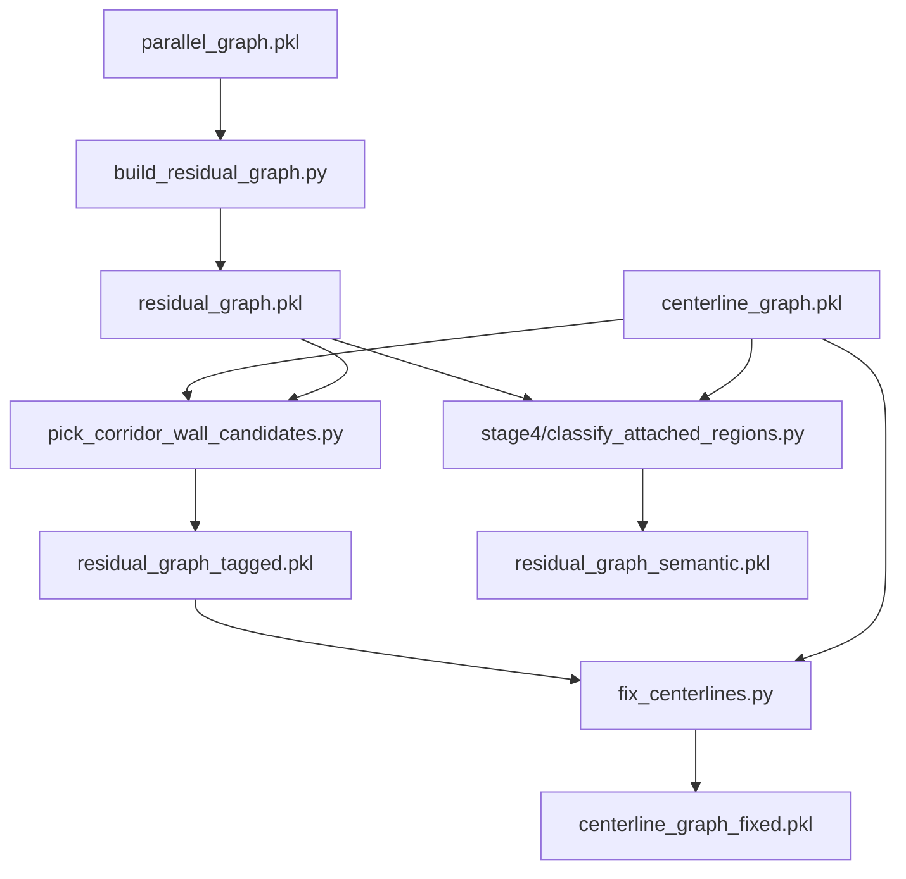

# Step 3B — Residual graph and centerline repair

Broken continuity usually comes from Step 2B: long walls are merged, but short segments at fillets, square bends, or H-shaped crossbars stay as **residual stubs** (`node_type == "stub"` in `parallel_graph.pkl`). Step 3A builds corridor candidates from parallel wall pairs, but the resulting centerline graph may have **gaps** where no `continue` edge exists because the bridging geometry lives in stubs, not in wall pairs.

Step 3B builds a **residual topology graph**, picks corridor-wall candidates, and repairs centerline geometry. **Semantic classification** of attached regions (crosscut / chamber / niche) lives in **Stage 4** — see `stage4/readme.md`.

## Pipeline (three scripts, run separately)



| Script | Input | Output | Role |
|--------|-------|--------|------|
| `build_residual_graph.py` | `parallel_graph.pkl` | `residual_graph.pkl` | Four edge kinds among stubs and walls (AABB grid + parallel candidate prune; geometry stays whole) |
| `pick_corridor_wall_candidates.py` | `residual_graph.pkl` + `centerline_graph.pkl` | `residual_graph_tagged.pkl` | Map corridors onto touch edges; tag `possible_corridor_wall` |
| `fix_centerlines.py` | `residual_graph_tagged.pkl` + `centerline_graph.pkl` | `centerline_graph_fixed.pkl` | Promote walls, extend centerlines, synthesize parallel connectors |

## Residual graph edge kinds

| Edge kind | Meaning |
|-----------|---------|
| `stub-stub-touch` | Stub endpoints linked within endpoint gap |
| `corridor-stub-touch` | Stub touches a corridor boundary wall (may carry `corridor_id` after mapping) |
| `stub-stub-parallel` | Parallel stub pair at corridor-like spacing |
| `corridor-stub-parallel` | Stub parallel to a corridor boundary wall |

**RC_v1** = connected components over `stub-stub-touch` only (matches legacy endpoint chaining).

**RC_v2** = components over `stub-stub-touch` ∪ `stub-stub-parallel` (used by Stage 4 as the primary attached-region partition).

## Mechanism boundaries

| Mechanism | Where | Trigger |
|-----------|-------|---------|
| **Synthesized connector** | `centerline_synthesis.py` (Step 3B) | Parallel component, two resolved wall sides, axial corridor attachment both ends |
| **Crosscut** | Stage 4 → future Stage C | `POTENTIAL_CROSSCUT`, orthogonal to both corridors |
| **Chamber exclusion** | Stage 4 → Stage B gates | `CHAMBER` stubs skipped in wall promotion |

Do not call synthesized connectors "crosscuts" or "bridged centerlines".

## How to run

```bash
# Step 3B (prerequisites: step2B parallel_graph, step3A centerline_graph)
python step3B/build_residual_graph.py --stem 2026.1-1-巷道
python step3B/pick_corridor_wall_candidates.py --stem 2026.1-1-巷道
python step3B/fix_centerlines.py --stem 2026.1-1-巷道

```

### Inspect outputs

| File | Contents |
|------|----------|
| `step3B/output/{stem}_residual_graph.png` | Stub topology, RC_v1 colouring |
| `step3B/output/{stem}_secondary_wall_candidates.png` | Tagged possible corridor walls (secondary) |
| `step3B/output/{stem}_centerline_fix.png` | Promotions + synthesized connectors (purple) |
| `stage4/output/{stem}_attached_regions.png` | Crosscut orange, chamber red, niche yellow |

Tune stub grouping if endpoints are missed or over-merged:

```bash
python step3B/build_residual_graph.py --stem 2026.1-1part-巷道 \
  --endpoint-link-gap-scale 1.5 \
  --attach-tol-scale 0.2
```

## Module map

| Module | Role |
|--------|------|
| `residual_graph.py` | Build graph, RC_v1, edge helpers |
| `residual_component.py` | Legacy RC builder (validation against RC_v1) |
| `corridor_mapping.py` | Write `corridor_id` on touch edges |
| `corridor_wall_candidates.py` | Detect parallel corridor-wall stubs |
| `wall_promotion.py` | Promote stubs to walls |
| `centerline_fix.py` | Extend centerline endpoints |
| `centerline_synthesis.py` | Parallel connector centerlines (not crosscuts) |
