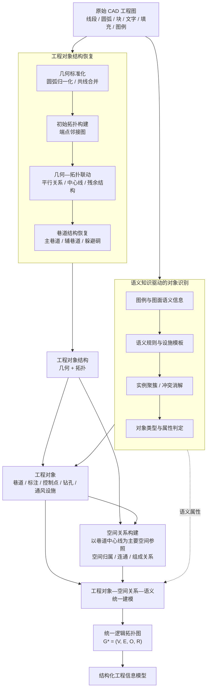

```mermaid
flowchart TB

    A["原始 CAD 工程图<br/>线段 / 圆弧 / 块 / 文字 / 填充 / 图例"]

    subgraph B["工程对象结构恢复"]
        direction TB
        B1["几何标准化<br/>圆弧归一化 / 共线合并"]
        B2["初始拓扑构建<br/>端点邻接图"]
        B3["几何—拓扑联动<br/>平行关系 / 中心线 / 残余结构"]
        B4["巷道结构恢复<br/>主巷道 / 辅巷道 / 躲避硐"]
        B1 --> B2 --> B3 --> B4
    end

    C["工程对象结构<br/>几何 + 拓扑"]

    subgraph D["语义知识驱动的对象识别"]
        direction TB
        D1["图例与图面语义信息"]
        D2["语义规则与设施模板"]
        D3["实例聚簇 / 冲突消解"]
        D4["对象类型与属性判定"]
        D1 --> D2 --> D3 --> D4
    end

    E["工程对象<br/>巷道 / 标注 / 控制点 / 钻孔 / 通风设施"]

    F["空间关系构建<br/>以巷道中心线为主要空间参照<br/>空间归属 / 连通 / 组成关系"]

    G["工程对象—空间关系—语义<br/>统一建模"]

    H["统一逻辑拓扑图<br/>G* = (V, E, O, R)"]

    I["结构化工程信息模型"]

    A --> B
    B --> C

    A --> D
    C --> E
    D --> E

    C --> F
    E --> F

    D -. "语义属性" .-> G
    E --> G
    F --> G

    G --> H --> I
```
