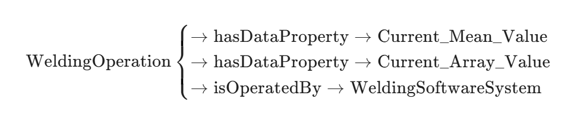

### 1234
此文提出了一种名为PlankAssembly的方法，用于从三个正交视图（正面、顶面和侧面）中鲁棒地重建3D CAD模型，特别针对柜类家具。该方法利用Transformer-based序列生成模型，将问题转化为序列到序列（seq2seq）任务，通过学习形状程序来组装木板（planks），以应对输入视图中的噪声或不完整性。以下是对该方法的详细解释，结构化为关键组件，以便清晰理解。
1. 问题背景与动机
传统方法通过在2D观测与3D空间之间建立显式对应（如逐级生成3D顶点、边、面和体）来重建模型，但对输入中的错误（如缺失线条或端点不准）敏感，导致实际应用中失败率高。该文针对柜类家具（由轴对齐长方体木板组装而成），引入深度学习方法，利用注意力机制实现输入与输出的柔性映射，从而提升鲁棒性。同时，设计特定领域语言（DSL）生成形状程序，便于下游CAD编辑。
2. 方法概述
PlankAssembly将输入视图编码为1D序列，输出为形状程序序列。该程序描述柜子的组装过程，包括声明木板并指定其附件关系。模型采用Transformer编码器-解码器架构，自动回归生成输出。核心创新包括：

将重建视为seq2seq问题，使用注意力捕捉设计师意图。
引入指针生成器网络（Pointer-Generator Network），允许输出指向先前预测的附件或从词汇表中选择坐标值。
专注于柜类家具的DSL，提升准确性和可编辑性。

3. 领域特定语言（DSL）与形状程序
柜子被表示为有向无环图（DAG），节点为木板的面（每个轴对齐长方体有6个自由度：xmin, ymin, zmin, xmax, ymax, zmax），边表示附件关系（一个面最多附着于另一个面）。

DSL语法：使用Union结构指定坐标——数值或指向另一木板的坐标（附件）。
形状程序：命令序列，如声明Cuboid并附着面（例如，Program 1所示）。程序执行 incrementally 构建柜子，支持全局/局部编辑（如缩放或修改单个木板）。
DAG表示：确保拓扑顺序，附件优先于几何实体，便于序列化。

4. 输入与输出编码

输入序列（Vseq）：三个视图的2D边扁平化为序列（长度Nv = 4  总边数）。每边为(x1, y1, x2, y2)，按视图排序并量化（9位整数）。嵌入包括值、视图、边位置、坐标位置和类型（可见/隐藏）。
输出序列（Gseq）：DAG序列化，按拓扑顺序（后继先于前驱），附件优先。嵌入包括值、木板位置和面位置。使用[SOS]和[EOS]标记起始/结束。
量化：坐标量化为512维嵌入，确保模型处理离散值。

5. 模型架构

编码器：6层Transformer，处理输入嵌入，生成上下文表示。
解码器：6层Transformer，自动回归生成输出。在时间步t，输出隐藏特征ht，计算：
词汇分布p_vocab（softmax(linear(ht))），从固定词汇（量化坐标）选择。
附件分布p_attach（softmax(linear(ht)^T h_<t)），指向先前输出（Pointer Network）。
附件概率wt = sigmoid(linear(ht))，加权融合：p = (1-wt)  p_vocab + wt  p_attach。

损失：交叉熵最大化条件分布。
推理优化：掩码无效附件（仅相反轴自由度），过滤零体积木板。

6. 训练与实现

数据集：新建基准，包含26,000+专业设计师创建的柜子模型（训练24,039，验证1,329，测试1,339）。使用pythonOCC生成视图，解析为形状程序（附件基于距离<1mm和面类型）。
训练：PyTorch Lightning，Adam优化器（学习率10^-4），批大小64，400K迭代，4张RTX 3090 GPU。
评估指标：精度、召回和F1分数，使用匈牙利匹配和IOU>0.5判断真阳性。
推理时间：约0.63秒/样本。

7. 实验结果与优势

与传统方法比较：[25,28]在干净输入上F1为94.07%，但噪声30%时降至8.20%（或超时）。本方法从91.75%仅降至90.14%，仅可见边输入时F1为82.62%（传统39.31%）。
消融研究：
输入：线序列优于图像（稀疏特征）和侧面（显式对应降低鲁棒性）。
输出：形状程序优于PolyGen [24]（F1更高，速度快6倍，避免非闭合固体）。

定性：处理噪声/不完整输入时，正确重建复杂柜子，支持编辑。
失败案例：附件错误或早停（自动回归常见问题）。

该方法首次将深度生成模型应用于此任务，证明注意力与领域知识的结合可显著提升鲁棒性和实用性。未来可扩展至机械零件等领域。

### Detailed Explanation of Input Sequence (Vseq)

The input sequence, denoted as Vseq, represents the flattened representation of the 2D edges from the three orthographic views: front (VF), top (VT), and side (VS). Each view is treated as a planar graph consisting of 2D edges and their intersection points. Solid lines indicate visible edges, while dashed lines represent hidden ones. To construct Vseq, the process begins by ordering the edges within each view separately, then concatenating them in the order of front, top, and side views.

Specifically, for each 2D edge, it is parameterized as a tuple (x1, y1, x2, y2), where the endpoints are sorted such that x1 ≤ x2 (and if x1 = x2, then y1 ≤ y2). The edges within a single view are then sorted lexicographically based on the sequence x1, followed by x2, y1, and y2. This ensures a consistent and deterministic ordering. Once ordered, all edges from the three views are flattened into a single 1D sequence Vseq = {v1, v2, ..., vNv}, where Nv = 4 × Nedge (Nedge being the total number of edges across all views, since each edge contributes four tokens: two coordinates per endpoint).

To prepare Vseq for the Transformer model, each token vi is embedded into a 512-dimensional vector using a combination of positional and semantic embeddings, as defined in Equation (2):

E(vi) = E_value(vi) + E_view(vi) + E_edge(vi) + E_coord(vi) + E_type(vi)

- E_value(vi): This is the embedding for the quantized coordinate value of vi. All coordinates are quantized into 9-bit integers (i.e., values from 0 to 511) to discretize the continuous space and enable the model to handle them as categorical tokens.
- E_view(vi): Indicates the originating view (front, top, or side), helping the model distinguish contextual differences between projections.
- E_edge(vi): Encodes the relative position of the edge within its view's sorted list, providing intra-view positional awareness.
- E_coord(vi): Specifies the position of the coordinate within the edge (e.g., 1 for x1, 2 for y1, 3 for x2, 4 for y2), aiding in understanding edge structure.
- E_type(vi): Differentiates between visible (solid) and hidden (dashed) edges, which is crucial for inferring occluded parts in noisy or incomplete inputs.

This multi-faceted embedding allows the Transformer encoder to capture both geometric and contextual information, enabling robust handling of imperfections like noise or missing lines.

### Detailed Explanation of Output Sequence (Gseq)

The output sequence Gseq is a serialized representation of the directed acyclic graph (DAG) G = {F, E}, where F are the faces of the plank models (each axis-aligned cuboid plank has six faces corresponding to its degrees of freedom: xmin, ymin, zmin, xmax, ymax, zmax), and E represents attachment relationships (directed edges from one face to another, with at most one outgoing edge per face).

To serialize the DAG into Gseq, a vertex order π is first defined. This order prioritizes topological sorting to ensure that direct successors (attached faces) appear before their predecessors in the sequence. For vertices not connected by dependencies, they are further sorted by their coordinate values. This ordering facilitates auto-regressive generation while preserving the assembly logic (attachments before pure geometry).

The sequence Gseq is then constructed such that each element gi corresponds to either a face or an attachment edge, as per Equation (3):

gi = 
- f^π_i, if A^π_ij = 0 for all j (i.e., no outgoing attachment),
- e^π_{i→j}, if A^π_ij = 1 (i.e., an attachment from f^π_i to f^π_j).

Special tokens [SOS] (start-of-sequence) and [EOS] (end-of-sequence) are added to mark the beginning and end. Attachments are prioritized in the sequence to mimic human design processes, where constraints (attachments) are often specified before absolute coordinates.

For decoder inputs, each gi is embedded as E(gi) = E_value(f^π_i) + E_plank(f^π_i) + E_face(f^π_i), per Equation (4):

- E_value(f^π_i): The quantized coordinate value (shared with input embeddings for consistency).
- E_plank(f^π_i): Indicates the plank's position in the overall cabinet model, providing global context.
- E_face(f^π_i): Specifies the face's relative position within its plank (e.g., xmin vs. xmax).

If gi is an attachment edge e^π_{i→j}, the value embedding uses that of the target face f^π_j. This design allows the decoder to generate sequences that alternate between declaring new faces/planks and specifying attachments, ensuring the output forms a valid shape program.

An example from the paper (Program 1 on page 3) illustrates this: A simple cabinet is built incrementally with commands like declaring cuboids and attachments, resulting in a sequence where attachments (e.g., pointing one plank's xmin to another's xmax) precede or interleave with value specifications.

### Detailed Explanation of Quantization

Quantization discretizes the continuous coordinate values into a finite vocabulary, making the problem suitable for sequence generation with categorical distributions. All coordinates (both in inputs and outputs) are mapped to 9-bit integers (0 to 511), which balances granularity with computational efficiency—sufficient for cabinet dimensions without excessive precision loss.

These quantized values are then embedded into learned 512-dimensional vectors (E_value). The high dimensionality (512-D) allows the embeddings to capture nuanced geometric relationships, such as spatial proximity or alignment, which the Transformer learns during training. This ensures the model processes discrete tokens rather than raw floats, reducing sensitivity to minor perturbations (e.g., noisy endpoints) and enabling probabilistic generation over a fixed vocabulary.

In practice, this quantization supports the pointer-generator mechanism: During decoding, the model can predict either a quantized value from the vocabulary or point to a prior token in the sequence for attachments, as weighted by the attachment probability wt.

https://github.com/manycore-research/PlankAssembly

# 《Ontology Reshaping for Knowledge Graph Construction: Applied on Bosch Welding Case》（用于知识图谱构建的本体重塑：应用于博世焊接案例）
https://openaccess.city.ac.uk/id/eprint/29099/1/ISWC2022_InUse_OntoReshaping.pdf

## 论文核心观点问题与挑战：
 自动知识图谱（KG）构建在工业界被广泛用于数据集成。一种关键方法是将原始数据映射到给定的领域本体（作为KG模式），然后构建实体和属性。然而，传统的领域本体是知识导向的（反映一般领域知识），而KG模式需要是数据导向的（充分覆盖所有数据特征）。直接使用领域本体作为KG模式会导致效率不高、生成的KG不够应用导向，并可能产生空节点等问题。
 提出的方案——本体重塑： 论文提出了一个本体重塑系统（Ontology Reshaping），旨在解决上述权衡问题。它从给定的领域本体和关系数据模式出发，生成一个新的“重塑后”本体。这个重塑后的本体既能充分覆盖数据，又很好地保留了领域知识。
 该系统实现了通过本体重塑增强的知识图谱构建算法。它可以自动将领域本体重塑为数据导向的本体作为知识图谱模式。使用这种重塑后的本体来构建知识图谱，避免了空节点（dummy nodes）的产生。
 应用案例： 论文将该方法应用于博世（Bosch）焊接案例，展示了其有效性。
 关键技术和概念知识图谱构建： 将数据转化为结构化的知识图谱。
 领域本体 ($G_{do}$)： 描述特定领域概念、关系和规则的知识导向的模式。关系模式 ($R$)： 关系型数据表的结构。重塑后本体 ($G_{ro}$)： 既覆盖数据又保留领域知识的新的知识图谱模式。
 简而言之，这项工作提供了一种系统化的方法，通过自动调整现有的领域本体以适应具体数据结构，从而提高工业级知识图谱构建的效率和质量。

## 算法细节
1. 初始状态：领域本体 ($G_{do}$)博世的焊接监控领域有一个知识导向的领域本体 $G_{do}$。它设计得非常详细和通用，用于描述领域内所有的概念和关系。假设本体中有一条概念链，用于描述焊接操作、测量数据和软件系统之间的关系：$$\text{WeldingOperation} \rightarrow \text{isOperatedBy} \rightarrow \text{WeldingSoftwareSystem}$$
同时，它可能还定义了获取测量数据（例如电流值）的详细路径：$$\text{WeldingOperation} \rightarrow \text{hasMeasurementModule} \rightarrow \text{MeasurementModule} \rightarrow \text{hasOperationCurveCurrent} \rightarrow \text{OperationCurveCurrent}$$问题： 这是一个标准的、知识完备的本体，但它与实际的原始数据 ($R$) 不匹配。
2. 原始数据 ($R$) 和映射 ($M_{do}$) 的不匹配在实际的焊接数据集中，存在以下数据特性：
数据覆盖不全： 原始数据中没有与本体中的 $\text{MeasurementModule}$（测量模块）和 $\text{OperationCurveCurrent}$（操作曲线电流）这两个类相对应的表格或属性。
关系简化： 在数据中，每一个 $\text{WeldingOperation}$ 都有一个直接的电流平均值（Current Mean Value）和一个电流数组值（Current Array Value）。
连接稀疏： 一个 $\text{WeldingSoftwareSystem}$ 负责一大组 $\text{WeldingOperation}$，它们的对应关系通常是间接的。如果直接使用 $G_{do}$ 作为知识图谱模式，会导致以下问题：产生空节点（Dummy Nodes）： 对于数据中不存在的 $\text{MeasurementModule}$ 和 $\text{OperationCurveCurrent}$，KG 构建器会创建大量没有实际数据的“空节点”，导致知识图谱稀疏、庞大且效率低下。
查询复杂： 用户如果想查询一个焊接操作的电流值，需要通过一个冗长的、多跳的路径才能到达数据属性，这不“用户友好”。
3. 算法执行：“本体重塑” ($G_{ro}$)$\text{OntoReshape}^+$ 算法的作用是简化 $G_{do}$，生成一个数据导向的 $G_{ro}$。
步骤 1：识别与数据不匹配的节点（Tree Collapse 目标）算法分析 $R$ 和 $M_{do}$，识别出 $\text{MeasurementModule}$ 和 $\text{OperationCurveCurrent}$ 两个类，它们是本体的中间节点，但在数据中没有对应的实例。
步骤 2：执行结构塌陷（Tree Collapse）算法将这些数据不支持的中间节点从本体结构中移除，并保持起点和终点之间的连通性。起点： $\text{WeldingOperation}$终点： 最终的电流数据属性（例如：Current_Mean_Value）。算法将这条冗长的路径：$$\text{WeldingOperation} \rightarrow \text{hasMeasurementModule} \rightarrow \text{MeasurementModule} \rightarrow \dots \rightarrow \text{OperationCurveCurrent}$$塌陷并简化为直接的数据属性连接。
步骤 3：保留核心领域知识和数据特性算法在简化结构的同时，保留了两个关键的元素：数据属性： 将数据中实际存在的 Current_Mean_Value 和 Current_Array_Value 作为数据属性，直接连接到 $\text{WeldingOperation}$ 节点上。重要的关系： 保留 $\text{WeldingOperation} \rightarrow \text{isOperatedBy} \rightarrow \text{WeldingSoftwareSystem}$ 这样的重要对象属性，因为它们代表了核心的领域关系。
4. 结果：重塑后本体 ($G_{ro}$)重塑后的本体 $G_{ro}$ 结构变得非常紧凑和直接：

$$\text{WeldingOperation} \begin{cases} \rightarrow \text{hasDataProperty} \rightarrow \text{Current\_Mean\_Value} \\ \rightarrow \text{hasDataProperty} \rightarrow \text{Current\_Array\_Value} \\ \rightarrow \text{isOperatedBy} \rightarrow \text{WeldingSoftwareSystem} \end{cases}$$
效果：
数据覆盖率 (R1) 得到满足： $G_{ro}$ 充分涵盖了原始数据 $R$ 中的所有相关信息。
效率 (R4) 和用户友好性 (R3) 提高： 由于去除了冗长的中间节点，生成的知识图谱体积大大减小（论文提到实体数量减少到 $1/2$ 到 $1/6$，生成速度提高 7 到 8 倍），查询路径也更简单。
知识覆盖率 (R2) 保留： 核心的 $\text{WeldingOperation}$ 和 $\text{WeldingSoftwareSystem}$ 关系被保留，重要的领域知识没有丢失。
通过这个重塑过程，原本知识导向的、通用的本体，被高效地转换为一个特定应用的、数据导向的知识图谱模式。

# 《基于工艺知识图谱的异构 CAM 模型结构化建模》（Structured modeling of heterogeneous CAM model based on process knowledge graph）

该文提出了一种用于解决现代制造中异构 CAM 模型（Computer-Aided Manufacturing Models）数据共享和重用问题的知识方法论。

## 核心内容概括
1. 解决的痛点（问题）在定制化生产和全球化协作的背景下，企业会生成和存储大量使用不同 CAD/CAM 系统（如 CATIA、UG NX）产生的异构 CAM 模型（包含 CAD 模型和 NC 工艺）。

数据孤岛：由于各个系统采用自己固有的知识表示方案、数据格式和组织结构，导致这些模型中的专家知识和经验难以有效地共享和重用，造成资源浪费 。

语义缺失： 现有的数据交换标准（如基于 STEP-NC 的模型），虽然能实现文件交换，但缺乏对高级工艺规划知识和设计意图的语义描述能力（例如，无法直接表达“粗铣型腔”、“精铣型腔”等高级意图）。

2. 提出的解决方案（方法）论文提出了一种基于工艺知识图谱（Process Knowledge Graph, PKG）的结构化建模方法，以实现异构 CAM 模型的统一语义表示 。

（1）构建工艺知识图谱（PKG）：
 构建一个多层次、多要素的 PKG，作为统一的知识结构 。
 该图谱将 CAD 模型信息（如零件、加工特征、制造语义）和 NC 工艺知识（包括宏观工艺规划 MAPP 和 微观工艺规划 MIPP）在统一的框架内进行组织 。

（2）建立 CAM 系统本体（Ontology）：
为每一个异构 CAM 系统（如 CATIA、UG NX）建立其自身的本体模型 。
本体用于准确、一致地组织和描述各个系统中固有的概念和术语 。

（3）多策略本体映射：
多策略本体映射（如概念映射、属性映射、语义映射），实现异构 CAM 系统本体与 PKG 之间的概念和语义匹配 。这一步获得了 CAM 模型数据的初步统一语义表示。

（4）基于规则的推理：
基于规则的推理SWRL 等，获取和补充 CAM 模型中隐式（Implicit）的工艺知识和设计意图 。
例如，推断出“基准优先”、“先粗加工后精加工”等宏观工艺规划决策知识，并检查数据的准确性，从而保证 PKG 的完整性和一致性 。

## 3. 主要贡献与效果 
统一结构化表示： 实现了异构 CAM 模型的统一结构化语义表示，有效支持协同设计环境下的知识共享和数据传输 。

知识完备性： PKG 能够同时包含宏观工艺规划（MAPP）和微观工艺规划（MIPP）知识，并且通过推理弥补了隐式工艺知识的不足，更好地描述了工艺设计意图 。

多层次粒度： 采用零件、耦合特征簇、加工特征的多层次结构粒度，比传统方法更具层次性和全面性 。

## 4.算法实现
论文内容聚焦于知识表示和语义映射，而不是传统的数值计算算法，其“实现细节”主要体现在数据模型的构建和推理逻辑上。
异构 CAM 模型结构化建模的算法实现该方法的核心在于构建一个工艺知识图谱 (PKG)，并设计一套机制将异构 CAM 模型（原始数据）的知识准确、完整地映射到这个 PKG 中。
步骤一：构建多层次、多要素的工艺知识图谱（PKG）PKG 是最终的目标模式，它以一种统一的、结构化的方式表示制造知识，旨在指导数据映射和交换。
PKG 的设计考虑了不同层次的工艺决策和信息：
零件级 (Part Level)： 整体零件信息、材料、装配关系等。
耦合特征簇级 (Coupled Feature Cluster, CFC)： 识别相互关联、需要一起加工的特征组。
加工特征级 (Machining Feature)： 单个几何特征，如孔、槽、型腔，及其制造语义。
多要素知识集成： PKG 的节点和关系同时捕获了 CAD 和 NC 工艺知识：
CAD 知识： 几何信息（尺寸、公差）、拓扑关系（相邻、连接）。
NC 工艺知识（Process Knowledge）：
宏观规划 (MAPP)： 描述工件的装夹、基准选择、工序排序等。
微观规划 (MIPP)： 描述具体工步的刀具、切削参数、走刀策略等。

 定义一套涵盖所有这些层次和要素的本体结构（Class, Property, Relation），作为 PKG 的模式。

步骤二：建立 CAM 系统本体（$O_{\text{CAM}}$）为了处理异构系统的差异，必须首先准确描述各个源系统的数据结构。目的： 为每个异构 CAM 系统（例如，CATIA 或 UG NX）建立一个本地的本体模型 $O_{\text{CAM}}$。

内容： $O_{\text{CAM}}$ 负责组织和描述该系统中固有的概念和术语，包括其特有的特征命名、参数定义、以及存储工艺数据的方式。
这是对源系统数据的语义抽象，而不是简单的数据解析。它将 CAM 文件中的原始数据映射为本体中的类和属性，以便进行下一步的语义比较。

步骤三：多策略本体映射这一步是解决异构性问题的核心。它将特定于 CAM 系统的本地语义（$O_{\text{CAM}}$）与统一的全局语义（PKG）进行匹配。
输入： 各个 $O_{\text{CAM}}$ 本体和目标 PKG。
目标： 建立 $O_{\text{CAM}} \leftrightarrow PKG$ 之间的映射集 $M$。
采用的映射策略（“多策略”体现）：
概念/属性名称匹配： 基础的字符串和同义词匹配。例如，UG NX 中的 $\text{Pocket}$ 可能映射到 PKG 中的 $\text{Cavity}$。
结构匹配： 基于本体结构的比较。如果 $O_{\text{CAM}}$ 中的两个概念之间的关系（边）与 PKG 中两个概念之间的关系相似，则认为它们是匹配的。
语义匹配/规则匹配（最关键）： 使用领域知识或映射规则来解决概念层次或语义不一致的问题。例如：将 UG NX 中特定的加工操作参数组合 映射到 PKG 中“粗加工”或“精加工”的宏观工艺语义。
依赖于一个本体映射工具和一套由领域专家定义的映射规则集。
 
步骤四：基于规则的推理（获取隐式语义）这是方法论中实现“知识”的关键步骤，它超越了简单的数据转换，用于发现和补充 CAM 模型中隐含的工艺知识和设计意图。
推理目标： 识别宏观工艺规划（MAPP）知识，例如：基准优先关系： 哪个特征应该作为后续加工的基准面。加工顺序约束： 哪些工序必须在其他工序之前完成（例如，所有粗加工必须在精加工之前）。
实现技术： 使用语义 Web 规则语言（SWRL）等推理机制。

推理规则示例（概念逻辑）：如果 $\text{特征}(F1)$ 是 $\text{特征}(F2)$ 的 $\text{定位基准}$，则 $\text{加工操作}(Op1)$ 必须 $\text{先于}$ $\text{加工操作}(Op2)$。$\text{is\_Datum}(F1, F2) \land \text{has\_Operation}(F1, Op1) \land \text{has\_Operation}(F2, Op2) \Rightarrow \text{precedes}(Op1, Op2)$

通过这一步，最终构建的 PKG 是一个结构化、语义丰富且知识完备的模型，它不仅包含了原始数据，还包含了驱动这些数据的专家决策和设计意图，从而大大提高了知识重用的效率。

# 3D Interpreted Model: A Novel Product Definition Model by Integrating and Fusing a 3D Annotated Model and Design Knowledge
（3D 解释模型：一种通过集成和融合 3D 注释模型和设计知识的新型产品定义模型）
https://www.mdpi.com/2076-3417/11/16/7192

将基于模型定义（Model-Based Definition, MBD）与设计知识进行深度融合。

## 论文核心观点概括
1. 核心问题：MBD 的局限性

MBD 的本质：MBD 的核心理念是将所有工程技术信息（尺寸、公差、材料、表面处理等）直接集成到 3D 几何模型中，取代传统的 2D 工程图。

MBD 的不足： 现有的 MBD 模型（或 3D 注释模型）主要关注几何和标准化的注释信息，但它们往往缺乏对设计知识和意图的系统性表示。这些知识包括：设计约束、功能要求、为什么选择某个公差、制造工艺建议等。

目标：提出一个新的产品定义模型——3D 解释模型（3D Interpreted Model, 3DIM），以整合 MBD 的数据和设计知识。

2. 提出的解决方案：3D 解释模型（3DIM）3D 解释模型的核心思想是通过知识注释（Knowledge Annotation）将设计知识集成到3D 注释模型（MBD 模型）中，形成一个更加完备的产品定义数据集。

3. 知识融合的具体步骤
论文提出了一套系统的理论方法来实现设计知识与 MBD 模型的集成和融合：

 A：设计知识的建模与组织在知识图谱思想的启发下，设计知识首先被结构化。

 知识类型： 组织和分类设计知识，包括功能知识、约束知识、制造知识（如成本、效率、工艺选择）。

 知识表示： 将这些知识表示为规则、关系和概念，并存储在一个独立的知识库中。

 B：设计知识注释（Knowledge Annotation）这是融合过程的关键步骤。它定义了如何将抽象的知识与 3D 模型的具体几何特征和 MBD 注释信息关联起来。

 工具与环境： 在 CAD 环境中，通过扩展 MBD 的注释功能，创建知识注释。

 关联机制： 知识注释将知识库中的特定规则或语义信息，链接到 3D 模型中的特定特征、表面或公差区。
 例如： 将一条“高精度轴承配合面需要选择研磨工艺”的知识规则，直接链接到 3D 模型中的某个孔特征。

 C：3D 解释模型的构建通过知识注释，MBD 模型被扩展为 3D 解释模型（3DIM）。

 3DIM 的组成： 3DIM = 3D 几何模型 + 标准 MBD 注释 + 设计知识注释。
 
 优势： 3DIM 不仅描述了产品是什么（几何和公差），还描述了为什么这么设计以及应该如何制造（设计知识和意图）。

4. 结论与价值

 提高应用能力： 3DIM 扩展了产品模型的范围和内容，使得下游应用（如自动化工艺规划、公差分析、质量检测）可以直接从模型中获取设计意图和制造约束，而不仅仅是原始数据。
 
 改善知识重用： 设计知识被显式地集成和结构化，极大地提高了知识的透明度、可追溯性和重用能力。
 
 推动数字化研发： 强化了 MBD 作为产品数字化研发核心方法论的能力。

简而言之，该论文为 MBD 实践提供了一个理论框架和新的数据模型（3DIM），解决了 MBD 中设计意图和制造知识的缺失问题。
